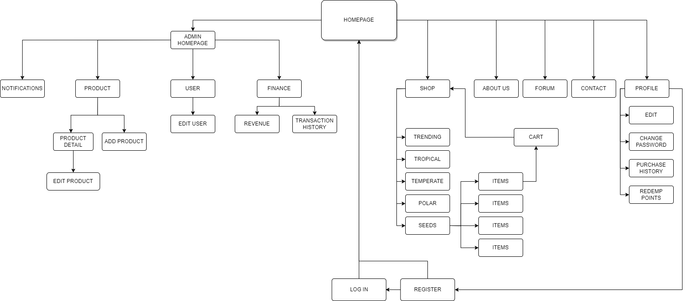
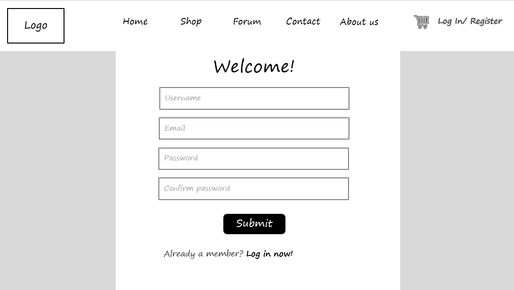
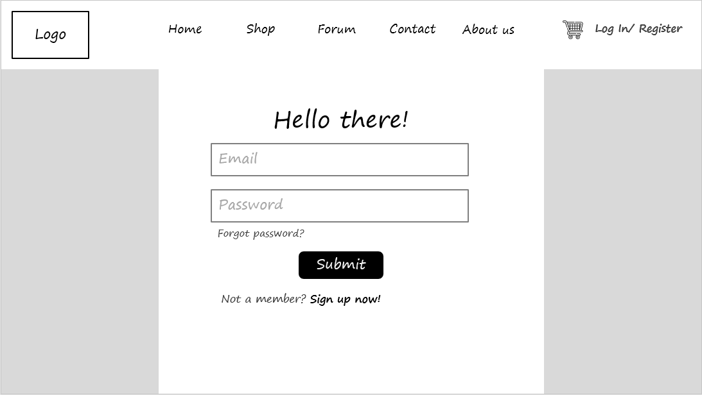

# PRJ301 PROJECT REPORT - PLANT HOUSE - CQMers Team

## Introduction
PLANT HOUSE is a shop which provide variety types of plants. We hope that planting will help people become fresher inside, make our life more colorful. We make real action - plant real tree that we will donate when the amount of tree could buy. 
***Make your life more green - Make our life more green - Together be healthy***
## Requirement

### Details of the system:
- Name of system:  Plant House
- What is the purpose of the system? 
Provide an online shop for trees, plants, and seeds, and also a healthy community for people 
who are passionate about gardening.
- Who uses the system? 
Customers who are interested in gardening, including young people and elders.
(This means that the design has to be concise, modern, and easy to interact with.) 
- Plant House team plant real trees on Earth. When our customers make a amount of purchases, we will partner with several Enviromental Organizations to plant real trees which are our products. 

### Features:
1. FOR USER:
- Search bar: 
You search for products there.
- Suggestions:
    - Trending items
    - Best - sellers
- Create an account: 
This allows you to make payments, access forums, and have a personalized experience.
- Forum: 
Inspired by Reddit, VOZ, and StackOverflow, the forum will provide a comfortable place for ideas exchanging, getting suggestions from experts, and a good place for you to ask for help. 
- Showing our Environmental activities.
- Profile modification:
    - Add/change avatar
    - Rename
    - Change password
    - Address for shipment
- Add to cart/remove from the cart.
- Purchase history
2. FOR ADMIN:
- Add/modify product
- Trending
- Transaction history
- Users management
- Forum management

### Sitemap && Wireframe:
- Sitemap

- Register

- Login

- Homepage

- Shop

- Forum

- Contact

- About us

- Profile

- Admin Role

## Conclusion
PLANT HOUSE is plant shop. We desire to create an easy-to-interact web application to shopping, a salutary web application to share and take in many infomations, knowledge, experience about plant.
Moreover, with a amount of sales in shop, shop will donate and particapate in plant real trees.
### CQMers 
**Member**
| ***Le Thi Yen Nhi*** | 
 ***Le Nguyen Tien Nhat*** |
 ***Van Anh Quan*** |

